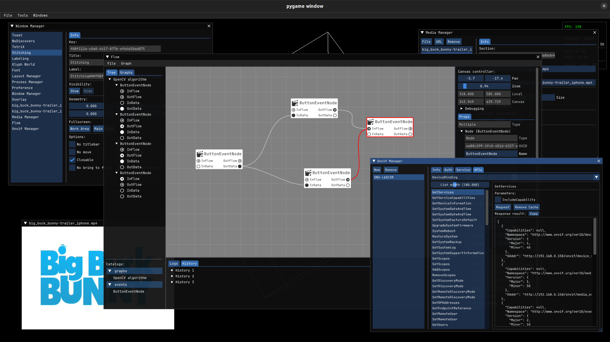

# cvp

[](https://pypi.org/project/cvp/)


**Computer Vision Player**



## Features

* ONVIF client
* WS-Discovery client
* FFmpeg media player
* Layout management
* Subprocess management
* Window management
* Font browser
* [Developing] Graph based visual programming
  * Built-in
  * OpenCV
  * NumPy
  * CuPy
  * Pandas

## Planned

* Plugin manager
* MediaMTX client
* LLM chatting
* Stitching tool
* Labeling tool
* 3D Model rendering
* Database browser
* CEF client
* GIS browser

## Developing

```shell
## Create a local Python virtual environment.
./python

## Black formatting
./black.sh

## PEP8 linting
./flake8.sh

## Sort import order
./isort.sh

## Type checking
./mypy.sh

## Unit testing
./pytest.sh
```

## Installation

### from pip

```shell
pip install cvp
```

### from source

```shell
git clone https://github.com/osom8979/cvp "$HOME/.local/share/cvp"
cd "$HOME/.local/share/cvp"
./run
```

## License

See the [LICENSE](./LICENSE) file for details. In summary,
**cvp** is licensed under the **MIT license**.
